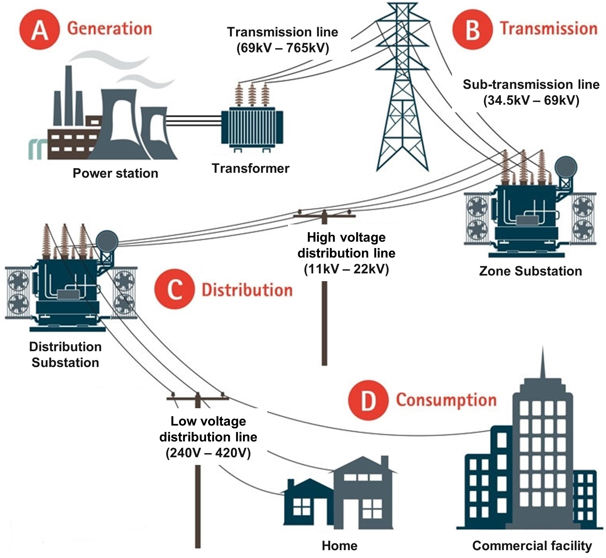

# QUT Zone Substation Security - SV attack datasets

## Background
Zone Substations are used to transform sub-transmission voltages (typically 34.5 kV to 69 kV) to high-voltage distribution voltages (typically 11 kV to 22 kV) and to act as controlling points between different high-voltage networks. Figure 1 illustrates the overall architecture and process of common power girds.

*Figure 1. Architecture and process of common power girds.*

Retrieved and edited from https://www.copper.org/environment/sustainable-energy/grid-infrastructure/

## Dataset Description
The datasets were generated and collected from a software-based simulation testbed. The details of the simulation testbed are shown in QUT-ZSS-2023-Simulation.

The datasets contain a wide variety of network and physical behaviours in the process bus level of an IEC-61850-compliant zone substation. The datasets are compatible with actual substation network traffic, including both Generic Object-Oriented Substation Event (GOOSE) and Sampled Value (SV) network packets. 

Generally, there are two different types of benign behaviours in substation operation: 1) fault-free operation when no unusual events happen; and 2) emergency operation when nonmalicious events (e.g., short-circuit faults) happen. Attacks can occur during both kinds of benign behaviours, which introduce two types of malicious behaviours: 3)~attacks under fault-free operation to disrupt energy transmission, and 4) attacks under emergency operation to disable or delay protection mechanisms.

All attack scenarios in our datasets are false data injection (FDI) attacks and replay attacks. All three forms of FDI attacks were implemented and launched from untrusted merging units (MUs) targeting SV communications, including 1) deletion of data from the original message; 2) modification of data in the original message, and 3) addition of fake data or fake messages. Additionally, to ensure our attack scenarios satisfy both stealth and sparsity of attacks, various attack configurations were applied in different attack scenarios, such as injecting or modifying different numbers of messages, injecting packets at different frequencies, and slightly increas-ing overcurrent measurements within certain ratios. 
